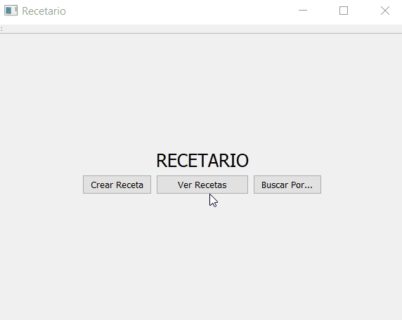

<h1 align="center">
   
  Recetario 📓 
   
</h1>

<h4 align="center">Una aplicacion de escritorio hecha con C++</h4>

  • <a href="#que-es-esto">Que es esto</a>
  • <a href="#requisitos">Requisitos</a>
  • <a href="#como-correr-el-codigo">Como correr el codigo</a>
  • <a href="#vista-previa">Vista previa</a>

## Que es esto

Esta es una aplicacion de escritorio creada para la materia Estructura de Datos y Algorítmos. 
La idea es aprovechar las ventajas que brinda SQL en particular mediante SQLite para generar un programa que almacene las recetas que se introducen por el usuario y permitir mostrar, modificar y realizar busquedas sobre las mismas.

## Requisitos

#### * Visual Studio
#### * Qt
#### * Qt Visual Studio Tools

## Como correr el codigo

#### 1. Clonar el repositorio
#### 2. Asegurese de tener instalado Qt
Puedes descargar el instalador de Qt al final de la siguiente página: [Qt](https://www.qt.io/download-open-source?hsCtaTracking=9f6a2170-a938-42df-a8e2-a9f0b1d6cdce%7C6cb0de4f-9bb5-4778-ab02-bfb62735f3e5)

#### 3. Instalar Qt Visual Studio Tools
Para instalar Qt Visual Studio Tools abrir la solucion (el proyecto de visual studio) dentro del repositorio descargado, dentro en el tab Extensions abrir "Manage Extensions" y dentro en la pestaña online buscar Qt Visual Studio Tools y descargarlo.

Una vez descargado cerrar visual studio para que se pueda instalar la extension (aparecerá un cartel indicando los pasos a seguir para la instalación).

#### 4. Configurar Qt Visual Studio Tools
Luego abir el projecto e ir al tab extensions y dentro ahora aparecerá un nuevo tab "Qt VS Tools" y dentro podremos seleccionar "Qt version" y dentro añadir una nueva Qt version definiendo el nombre y la ruta a la carpeta de instalacion de Qt, esta ruta es la ruta que dirige al directorio que incluye msvc en el nombre, por ejemplo en mi caso esta ruta se denomina de esta manera: "D:\Qt\5.14.2\msvc2017_64"

#### 5. Modificar la version de Qt en propiedades
Es probable que debas actualizar la version de Qt para el projecto, para hacer esto debes abrir el panel de propiedades para el proyecto (click derecho sobre el proyecto (no la solucion) -> propiedades)

Dentro de propiedades en la pestaña "Qt Project Settings" seleccionar en Qt instalation la version a utilizar.

## Vista previa

